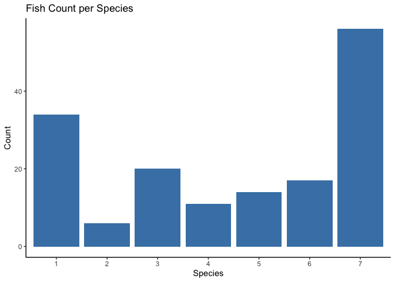
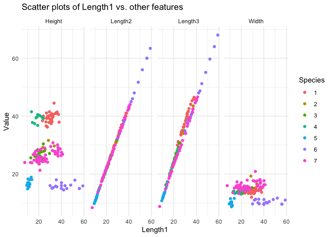
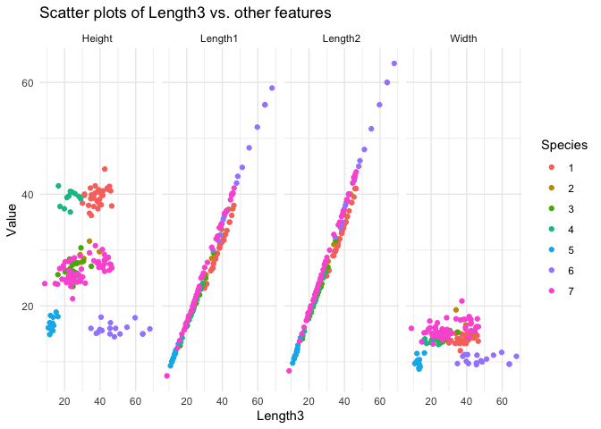
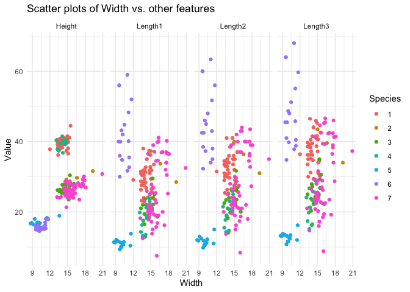

# Daten

Es wurde ein Datensatz verwendet, welcher aus Länge1, Länge2, Länge3, Höhe, Breite, Geschlecht, sowie dem Gewicht von 7 unterschiedlichen Fischarten besteht. Aus Länge1, Länge2, Länge3, Höhe und breite, sollte ein Classifier erstellt werden, welcher die Fischspezies aus einem Testdatensatz, bestehend aus jeder 10ten Reihe des Hauptdatensatzes, vorhersagen sollte.


```r
# load data frame
fish_df <- read.csv2("fishcatch.csv")

# remove unnecessary data
fish_df <- fish_df[48:nrow(fish_df),]

colnames(fish_df) <- c("Species", "Length1", "Length2", "Length3","Height", "Width",
                       "sex", "Weight")

fish_df <- as.data.frame(apply(fish_df, 2, function(x) gsub(",", ".", x)))

# List the columns you want to convert to numeric
columns_to_convert <- c("Length1", "Length2", "Length3","Height", "Width",
                       "Weight")

# counts fish classes
fish_count <- fish_df %>%
  group_by(Species) %>%
  summarise(Count = n())

# Convert the specified columns to numeric
fish_df <- fish_df %>%
  mutate(across(all_of(columns_to_convert), as.numeric))

# training data (data frame without every 10th row)
train_data <- fish_df[!(seq_len(nrow(fish_df)) %% 10 == 0), ]

# test df (every 10. Fish)
test_data <- fish_df[seq(1, nrow(fish_df), by = 10), ]
```
Im folgenden Diagramm ist die Anzahl der jeweiligen Fischspezies im Datensatz dargstellt.

```r
ggplot(fish_count, aes(x = Species, y = Count)) +
  geom_bar(stat = "identity", fill = "steelblue") +
  theme_classic() +
  labs(title = "Fish Count per Species",
       x = "Species",
       y = "Count")
```

<!-- -->
Die Normalverteilungsparameter sind in folgender Tabelle zusammengefasst.

```r
# group by species
grouped_fish <- fish_df %>%
  group_by(Species)

# calculates mean and standarddeviation
normal_params <- grouped_fish %>%
  summarise(
    Mean_Length1 = mean(Length1, na.rm = TRUE),
    Mean_Length2 = mean(Length2, na.rm = TRUE),
    Mean_Length3 = mean(Length3, na.rm = TRUE),
    Mean_Height = mean(Height, na.rm = TRUE),
    Mean_Width = mean(Width, na.rm = TRUE),
    Mean_Weight = mean(Weight, na.rm = TRUE),
    SD_Length1 = sd(Length1, na.rm = TRUE),
    SD_Length2 = sd(Length2, na.rm = TRUE),
    SD_Length3 = sd(Length3, na.rm = TRUE),
    SD_Height = sd(Height, na.rm = TRUE),
    SD_Width = sd(Width, na.rm = TRUE),
    SD_Weight = sd(Weight, na.rm = TRUE)
  )

print(normal_params)
```

```
## # A tibble: 7 × 13
##   Species Mean_Length1 Mean_Le…¹ Mean_…² Mean_…³ Mean_…⁴ Mean_…⁵ SD_Le…⁶ SD_Le…⁷
##   <chr>          <dbl>     <dbl>   <dbl>   <dbl>   <dbl>   <dbl>   <dbl>   <dbl>
## 1 1               30.3      33.1    38.4    39.6    14.1   626      3.64    3.97
## 2 2               28.8      31.3    34.3    29.2    15.9   531      5.58    5.72
## 3 3               20.6      22.3    25.0    26.7    14.6   152.     3.46    3.65
## 4 4               18.7      20.3    22.8    39.3    14.1   155.     3.28    3.56
## 5 5               11.3      11.9    13.0    16.9    10.2    11.2    1.22    1.43
## 6 6               42.5      45.5    48.7    15.8    10.4   719.     9.03    9.71
## 7 7               25.7      27.9    29.6    26.3    15.8   382.     8.56    9.02
## # … with 4 more variables: SD_Length3 <dbl>, SD_Height <dbl>, SD_Width <dbl>,
## #   SD_Weight <dbl>, and abbreviated variable names ¹​Mean_Length2,
## #   ²​Mean_Length3, ³​Mean_Height, ⁴​Mean_Width, ⁵​Mean_Weight, ⁶​SD_Length1,
## #   ⁷​SD_Length2
```

# Klassifikator

Zuerst werden die einzigartigen Fischarten aus den Trainingsdaten extrahiert und für jede Fischart werden die Mittelwerte, die Kovarianzmatrix und die a-priori Wahrscheinlichkeiten berechnet.

DDie Dichte der multivariaten Gaußverteilung für einen gegebenen Datenpunkt und die Verteilungsparameter wird berechnet.

Die classifier_fish Funktion klassifiziert einen Fisch basierend auf der Maximum-Likelihood-Methode. Dazu wird für jeden Datenpunkt die bedingte Wahrscheinlichkeit für jede Fischart berechnet und mit der a-priori Wahrscheinlichkeit multipliziert. Die Fischart mit der höchsten resultierenden Wahrscheinlichkeit wird als die vorhergesagte Spezies ausgewählt.

Schließlich wird der Klassifikator auf dem Testdatensatz angewendet und die Genauigkeit berechnet, indem die Anzahl der korrekt vorhergesagten Spezies durch die Gesamtanzahl der Vorhersagen geteilt wird.

Die Genauigkeit des Klassifikators beträgt 100%.

```r
# Calculate the mean, covariance, and a-priori probability for each fish species
species_list <- unique(train_data$Species)
stats_list <- lapply(species_list, function(species) {
  species_data <- train_data[train_data$Species == species, c("Length1", "Length2", "Length3", "Height", "Width")]
  n <- nrow(species_data)
  
  list(mean = colMeans(species_data),
       cov = cov(species_data) + diag(1e-6, ncol(species_data)),
       prior = n / nrow(train_data))
})

names(stats_list) <- species_list

# Multivariate Gaussian density function
multi_gau <- function(x, mean, cov) {
  k <- length(mean)
  exp(-0.5 * t(x - mean) %*% solve(cov, x - mean)) / sqrt((2 * pi)^k * det(cov))
}

# classifier
classifier_fish <- function(lengths) {
  likelihoods <- sapply(stats_list, function(params) {
    likelihood <- multi_gau(lengths, params$mean, params$cov)
    likelihood * params$prior
  })
  
  names(likelihoods)[which.max(likelihoods)]
}

# Classify each fish in the test set
predicted_species <- apply(test_data[, c("Length1", "Length2", "Length3", "Height", "Width")], 1, classifier_fish)

comparision_df <- data.frame(species = test_data$Species, prediction = predicted_species)

# Calculate accuracy
correct_predictions <- sum(predicted_species == test_data$Species)
total_predictions <- length(predicted_species)
accuracy <- correct_predictions / total_predictions

print(comparision_df)
```

```
##     species prediction
## 48        1          1
## 58        1          1
## 68        1          1
## 78        1          1
## 88        3          3
## 98        3          3
## 108       4          4
## 118       4          4
## 128       5          5
## 138       6          6
## 148       6          6
## 158       7          7
## 168       7          7
## 178       7          7
## 188       7          7
## 198       7          7
```

# Visualisierung

Im folgenden sind Diagramme dargestellt, welche die abhängigkeiten der einzelnen Variablen untereinander darstellen.

```r
# Create a long-format data frame
long_fish_1_df <- fish_df %>%
  dplyr::select(Species, Length1, Length2, Length3, Height, Width) %>%
  tidyr::gather(key = "Feature", value = "Value", -c(Species, Length1))

long_fish_2_df <- fish_df %>%
  dplyr::select(Species, Length1, Length2, Length3, Height, Width) %>%
  tidyr::gather(key = "Feature", value = "Value", -c(Species, Length2))

long_fish_3_df <- fish_df %>%
  dplyr::select(Species, Length1, Length2, Length3, Height, Width) %>%
  tidyr::gather(key = "Feature", value = "Value", -c(Species, Length3))

long_fish_4_df <- fish_df %>%
  dplyr::select(Species, Length1, Length2, Length3, Height, Width) %>%
  tidyr::gather(key = "Feature", value = "Value", -c(Species, Height))

long_fish_5_df <- fish_df %>%
  dplyr::select(Species, Length1, Length2, Length3, Height, Width) %>%
  tidyr::gather(key = "Feature", value = "Value", -c(Species, Width))

ggplot(long_fish_1_df, aes(x = Length1, y = Value, color = factor(Species))) +
  geom_point() +
  labs(x = "Length1", y = "Value", color = "Species") +
  theme_minimal() +
  facet_wrap(~Feature, ncol = 4) +
  ggtitle("Scatter plots of Length1 vs. other features")
```

<!-- -->

```r
ggplot(long_fish_2_df, aes(x = Length2, y = Value, color = factor(Species))) +
  geom_point() +
  labs(x = "Length2", y = "Value", color = "Species") +
  theme_minimal() +
  facet_wrap(~Feature, ncol = 4) +
  ggtitle("Scatter plots of Length2 vs. other features")
```

<!-- -->

```r
ggplot(long_fish_2_df, aes(x = Length2, y = Value, color = factor(Species))) +
  geom_point() +
  labs(x = "Length2", y = "Value", color = "Species") +
  theme_minimal() +
  facet_wrap(~Feature, ncol = 4) +
  ggtitle("Scatter plots of Length2 vs. other features")
```

<!-- -->

```r
ggplot(long_fish_3_df, aes(x = Length3, y = Value, color = factor(Species))) +
  geom_point() +
  labs(x = "Length3", y = "Value", color = "Species") +
  theme_minimal() +
  facet_wrap(~Feature, ncol = 4) +
  ggtitle("Scatter plots of Length3 vs. other features")
```

<!-- -->

```r
ggplot(long_fish_4_df, aes(x = Height, y = Value, color = factor(Species))) +
  geom_point() +
  labs(x = "Height", y = "Value", color = "Species") +
  theme_minimal() +
  facet_wrap(~Feature, ncol = 4) +
  ggtitle("Scatter plots of Height vs. other features")
```

<!-- -->

```r
ggplot(long_fish_5_df, aes(x = Width, y = Value, color = factor(Species))) +
  geom_point() +
  labs(x = "Width", y = "Value", color = "Species") +
  theme_minimal() +
  facet_wrap(~Feature, ncol = 4) +
  ggtitle("Scatter plots of Width vs. other features")
```

<!-- -->

# Quellen

[1] Vorlesungsscript

[2] Trevor Hastie Robert Tibshirani Jerome Friedman. The Elements of Statistical Learningm Data Mining, Inference, and Prediction. Springer Series in Statistics. 2009

[3] Towards Data Science. Quadratic Discriminant Analysis. Zugriffszeit: 05.05.2023 21:55 Uhr. https://towardsdatascience.com/quadratic-discriminant-analysis-ae55d8a8148a

# Packages

Es wurden folgende Packages verwendet:

tidyverse,
ggplot2,
zoo,
scales,
lubridate,
mvtnorm,
caret
