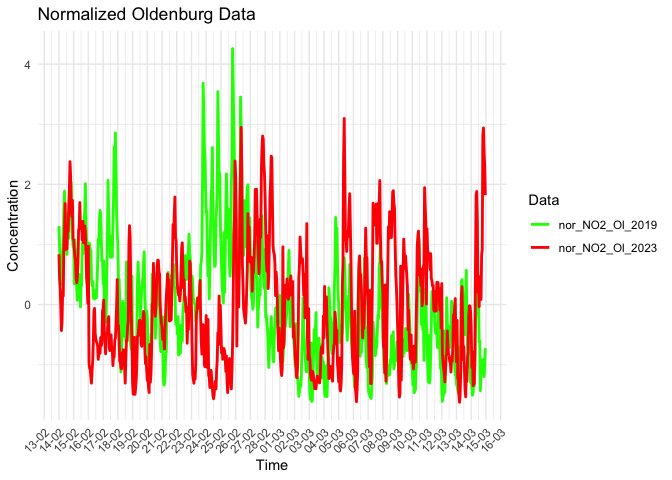
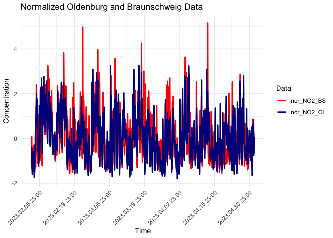
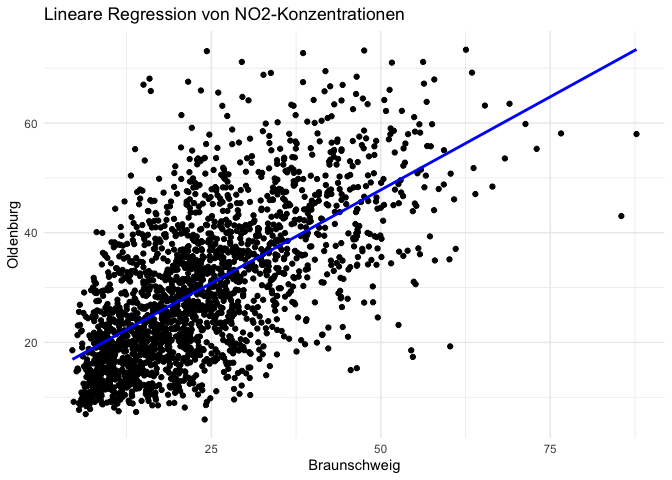

# Daten

Die vorliegenden Daten stammen aus der lufthygienischen Überwachung Niedersachsens und umfassen zwei Zeiträume: den historischen Zeitraum vom 28.12.2019 bis zum 28.03.2019 sowie den aktuellen Zeitraum vom 02.02.2023 bis zum 02.05.2023. Um die zeitliche Korrelation zu untersuchen, wurde der Zeitraum vom 15.02. bis zum 15.03. (sowohl 2019 als auch 2023) aus den Oldenburger Daten ausgewählt. Dazu wurden die Datensätze gefiltert und zusammengeführt.

Für die Analyse der räumlichen Korrelation wurden neben Oldenburg auch Daten vom Standort Braunschweig herangezogen. Um fehlende Werte in den Datenreihen zu ersetzen, wurde der gleitende Mittelwert verwendet. Dabei wurde ein Fenster von 48 Datenpunkten zur Berechnung des Durchschnitts herangezogen, um eine geglättete Version der ursprünglichen Daten zu erhalten.


```r
# load csv files
NO2_df <- read.csv2("city_data/NO2.csv")
NO2_hist_OL_df <- read.csv2("city_data_historic/Oldenburg_VS_181228_190328.csv")

#creating df NO2 Oldenburg and Braunschweig with current data
NO2_OL_df <- data.frame(NO2_df$Datum,NO2_df$Uhrzeit,NO2_df$Oldenburg_VS)
NO2_BS_df <- data.frame(NO2_df$Datum,NO2_df$Uhrzeit,NO2_df$Braunschweig_VS)

# changing col names
colnames(NO2_OL_df) <- c("Datum", "Uhrzeit", "ug/m^3")
colnames(NO2_BS_df) <- c("Datum", "Uhrzeit", "ug/m^3")

# change col Datum to date format
NO2_OL_df$Datum <- as.Date(NO2_OL_df$Datum, format = "%d.%m.%y")
NO2_BS_df$Datum <- as.Date(NO2_BS_df$Datum, format = "%d.%m.%y")
NO2_hist_OL_df$Datum <- as.Date(NO2_hist_OL_df$Datum, format = "%d.%m.%y")

# calculates walking mean for NAs
window_size <- 48  # number of elements used for walking mean

# running mean NO2 historic data Oldenburg
running_mean <- rollapply(NO2_hist_OL_df$ug.m, window_size, FUN = mean, 
                          na.rm = TRUE, partial = TRUE, align = "right")

# substitutes all missing values for the running mean
NO2_hist_OL_df$ug.m[is.na(NO2_hist_OL_df$ug.m)] <- running_mean[is.na(
                                                          NO2_hist_OL_df$ug.m)]

# running mean from February to May 2023 Oldenburg
running_mean <- rollapply(NO2_OL_df$`ug/m^3`, window_size, FUN = mean, 
                          na.rm = TRUE, partial = TRUE, align = "right")

# substitutes all missing values for the running mean
NO2_OL_df$`ug/m^3`[is.na(NO2_OL_df$`ug/m^3`)] <- running_mean[is.na(
                                                            NO2_OL_df$`ug/m^3`)]

# running mean from February to May 2023 Oldenburg
running_mean <- rollapply(NO2_BS_df$`ug/m^3`, window_size, FUN = mean, 
                          na.rm = TRUE, partial = TRUE, align = "right")

# substitutes all missing values for the running mean
NO2_BS_df$`ug/m^3`[is.na(NO2_BS_df$`ug/m^3`)] <- running_mean[is.na(
                                                            NO2_BS_df$`ug/m^3`)]

# creates df location correlation with current data Oldenburg, Braunschweig
loc_cor_NO2_OL_df <- data.frame(NO2_df$Datum, NO2_OL_df$`ug/m^3`,
                                NO2_BS_df$`ug/m^3`)
                                 
colnames(loc_cor_NO2_OL_df) <- c("Time","Oldenburg c(NO2) [ug/m^3]",
                                  "Braunschweig c(NO2) [ug/m^3]")

loc_cor_NO2_OL_df$Time <- paste(loc_cor_NO2_OL_df$Time, NO2_df$Uhrzeit)

# creating data frames for linear regression
NO2_OL_lin_reg_df <- NO2_OL_df$`ug/m^3`
NO2_BS_lin_reg_df <- NO2_BS_df$`ug/m^3`

# Create new columns with only day and month information
NO2_OL_df$DayMonth <- format(NO2_OL_df$Datum, "%d-%m")
NO2_hist_OL_df$DayMonth <- format(NO2_hist_OL_df$Datum, "%d-%m")
NO2_BS_df$DayMonth <- format(NO2_BS_df$Datum, "%d-%m")

# changes character to date
NO2_OL_df$DayMonth <- as.Date(NO2_OL_df$DayMonth, format = "%d-%m")
NO2_hist_OL_df$DayMonth <- as.Date(NO2_hist_OL_df$DayMonth, format = "%d-%m")
NO2_BS_df$DayMonth <- as.Date(NO2_BS_df$DayMonth, format = "%d-%m")

# sets a start and end date for filter
start_date <- as.Date("15-02", format = "%d-%m")
end_date <- as.Date("15-03", format = "%d-%m")

# takes only date between given start and end date
NO2_OL_df <- NO2_OL_df %>%
  filter(DayMonth >= start_date & DayMonth <= end_date)
NO2_hist_OL_df <- NO2_hist_OL_df %>%
   filter(DayMonth >= start_date & DayMonth <= end_date)
NO2_BS_df <- NO2_BS_df %>%
  filter(DayMonth >= start_date & DayMonth <= end_date)

# pastes the time into the date col
NO2_OL_df$DayMonth <- paste(NO2_OL_df$DayMonth, NO2_OL_df$Uhrzeit)

# creates df time correlation with current data and historic data 
time_cor_NO2_OL_df <- data.frame(NO2_OL_df$DayMonth, NO2_hist_OL_df$ug.m, 
                                 NO2_OL_df$`ug/m^3`)

# changes col names for better accaccessibility
colnames(time_cor_NO2_OL_df) <- c("Time","c(NO2) [ug/m^3] 2019",
                                  "c(NO2) [ug/m^3] 2023")
```


```r
# Normalize by subtracting the mean and dividing by the standard deviation
nor_time_1 <- (NO2_OL_df$`ug/m^3`-mean(NO2_OL_df$`ug/m^3`))/sd(NO2_OL_df$`ug/m^3`)
nor_time_2 <- (NO2_hist_OL_df$ug.m-mean(NO2_hist_OL_df$ug.m))/sd(NO2_hist_OL_df$ug.m)

# Create a new data frame with the normalized data and the corresponding time
nor <- data.frame(time_cor_NO2_OL_df$Time,nor_time_1,nor_time_2)
colnames(nor) <- c("Time", "nor_NO2_Ol_2023", "nor_NO2_Ol_2019")

# Transform into a long format data frame for easy plotting with ggplot2
nor_long <- nor %>% 
  pivot_longer(cols = starts_with("nor_NO2"),
               names_to = "Type",
               values_to = "Value")

# Convert the 'Time' column to POSIXct format for proper handling of 
# datetime data in ggplot2
nor_long$Time <- as.POSIXct(nor_long$Time, format = "%Y-%m-%d %H:%M")

# Plot the normalized data with ggplot2
ggplot(nor_long, aes(x = Time, y = Value, color = Type, group = Type)) +
  geom_line(linewidth = 1) +
  scale_x_datetime(labels = date_format("%d-%m"), breaks = date_breaks("1 day")) +
  theme_minimal() +
  theme(axis.text.x = element_text(angle = 45, hjust = 1)) +
  labs(title = "Normalized Oldenburg Data",
       x = "Time",
       y = "Concentration",
       color = "Data") +
  scale_color_manual(values = c("nor_NO2_Ol_2023" = "red", 
                                "nor_NO2_Ol_2019" = "green"))
```

<!-- -->


```r
# Normalize by subtracting the mean and dividing by the standard deviation
nor_loc_1 <- (loc_cor_NO2_OL_df$`Oldenburg c(NO2) [ug/m^3]`
              -mean(loc_cor_NO2_OL_df$`Oldenburg c(NO2) [ug/m^3]`
                    ))/sd(loc_cor_NO2_OL_df$`Oldenburg c(NO2) [ug/m^3]`)
nor_loc_2 <- (loc_cor_NO2_OL_df$`Braunschweig c(NO2) [ug/m^3]`
              -mean(loc_cor_NO2_OL_df$`Braunschweig c(NO2) [ug/m^3]`
                    ))/sd(loc_cor_NO2_OL_df$`Braunschweig c(NO2) [ug/m^3]`)

# Create a new data frame with the normalized data and the corresponding time
nor_loc <- data.frame(loc_cor_NO2_OL_df$Time,nor_loc_1,nor_loc_2)
colnames(nor_loc) <- c("Time", "nor_NO2_Ol", "nor_NO2_BS")

# Transform into a long format data frame for easy plotting with ggplot2
nor_loc_long <- nor_loc %>% 
  pivot_longer(cols = starts_with("nor_NO2"),
               names_to = "Type",
               values_to = "Value")

# Convert the 'Time' column to POSIXct format for proper handling of 
# datetime data in ggplot2

nor_loc_long$Time <- as.POSIXct(nor_loc_long$Time, format = "%d.%m.%y %H:%M")

# Plot the normalized data with ggplot2
ggplot(nor_loc_long, aes(x = Time, y = Value, color = Type, group = Type)) +
  geom_line(linewidth = 1) +
  scale_x_datetime(labels = date_format("%Y.%m.%d %H:%M"), breaks = date_breaks("2 week")) +
  theme_minimal() +
  theme(axis.text.x = element_text(angle = 45, hjust = 1)) +
  labs(title = "Normalized Oldenburg and Braunschweig Data",
       x = "Time",
       y = "Concentration",
       color = "Data") +
  scale_color_manual(values = c("nor_NO2_Ol" = "red", 
                                "nor_NO2_BS" = "green"))
```

<!-- -->


```r
# correlation function (lecture)
correlation_cof <- function(x, y) {
  n <- length(x)
  
  if (n != length(y)) {
    stop("Length of x must be the same then y.")
  }
  
  x_mean <- mean(x)
  y_mean <- mean(y)
  
  x_var <- var(x)
  y_var <- var(y)
  
  num <- sum((x - x_mean) * (y - y_mean))
  den <- x_var * y_var
  
  n_div <- 1/(n-1)
  
  correlation <- n_div * (num / den)
  return(correlation)
}
```


```r
cor_cof_time <- correlation_cof(nor_time_1, nor_time_2)
cor_cof_loc <- correlation_cof(nor_loc_1, nor_loc_2)

p_cor_time <- cor(nor_time_1, nor_time_2)
p_cor_loc <- cor(nor_loc_1, nor_loc_2)

print(p_cor_time)
```

```
## [1] 0.1625908
```

```r
print(cor_cof_time)
```

```
## [1] 0.1625908
```

```r
print(p_cor_loc)
```

```
## [1] 0.6315112
```

```r
print(cor_cof_loc)
```

```
## [1] 0.6315112
```
Ja, eine schwache oder fehlende Korrelation zwischen den 
Stickstoffdioxid-Konzentrationen in zwei verschiedenen Zeiträumen oder 
Datensätzen könnte im Sinne der Aufgabenstellung 
("Die Luft war nicht anders...") interpretiert werden. 
Eine schwache Korrelation legt nahe, dass die Stickstoffdioxid-Konzentrationen 
in einem Datensatz nicht eng mit denen im anderen Datensatz verknüpft sind.

In diesem Zusammenhang könnte eine schwache Korrelation bedeuten, dass sich die 
Luftqualität (in Bezug auf Stickstoffdioxid-Konzentrationen) im untersuchten 
Zeitraum oder zwischen den beiden untersuchten Standorten unterschiedlich 
entwickelt hat. Dies könnte darauf hindeuten, dass die Faktoren, die die 
Stickstoffdioxid-Konzentrationen beeinflussen, sich verändert haben oder 
zwischen den beiden Standorten unterschiedlich sind.

Dies könnte daran liegen, dass sich der Verkehr verändernt hat, oder regulationen
für Luftquailität eingeführt worden sind, sowie an Veränderungen der Klima
Bedingungen.


```r
# Lineare Regression durchführen
linear_model <- lm(loc_cor_NO2_OL_df$`Oldenburg c(NO2) [ug/m^3]`
                   ~ loc_cor_NO2_OL_df$`Braunschweig c(NO2) [ug/m^3]`)

# Ergebnisse des Regressionsmodells anzeigen
summary(linear_model)
```

```
## 
## Call:
## lm(formula = loc_cor_NO2_OL_df$`Oldenburg c(NO2) [ug/m^3]` ~ 
##     loc_cor_NO2_OL_df$`Braunschweig c(NO2) [ug/m^3]`)
## 
## Residuals:
##     Min      1Q  Median      3Q     Max 
## -35.476  -7.244  -0.993   6.099  43.458 
## 
## Coefficients:
##                                                  Estimate Std. Error t value
## (Intercept)                                      13.84718    0.48469   28.57
## loc_cor_NO2_OL_df$`Braunschweig c(NO2) [ug/m^3]`  0.67907    0.01804   37.64
##                                                  Pr(>|t|)    
## (Intercept)                                        <2e-16 ***
## loc_cor_NO2_OL_df$`Braunschweig c(NO2) [ug/m^3]`   <2e-16 ***
## ---
## Signif. codes:  0 '***' 0.001 '**' 0.01 '*' 0.05 '.' 0.1 ' ' 1
## 
## Residual standard error: 10.36 on 2136 degrees of freedom
## Multiple R-squared:  0.3988,	Adjusted R-squared:  0.3985 
## F-statistic:  1417 on 1 and 2136 DF,  p-value: < 2.2e-16
```

```r
data <- data.frame(Oldenburg = loc_cor_NO2_OL_df$`Oldenburg c(NO2) [ug/m^3]`
                   , Braunschweig = loc_cor_NO2_OL_df$`Braunschweig c(NO2) [ug/m^3]`)

plot <- ggplot(data, aes(x = Braunschweig, y = Oldenburg)) +
  geom_point() +
  geom_smooth(method = "lm", se = FALSE, color = "blue") +
  theme_minimal() +
  labs(x = "Braunschweig", y = "Oldenburg", title = "Lineare Regression von NO2-Konzentrationen")

# Plot anzeigen
print(plot)
```

```
## `geom_smooth()` using formula = 'y ~ x'
```

<!-- -->

R-quadarat Wert von 0.3988
